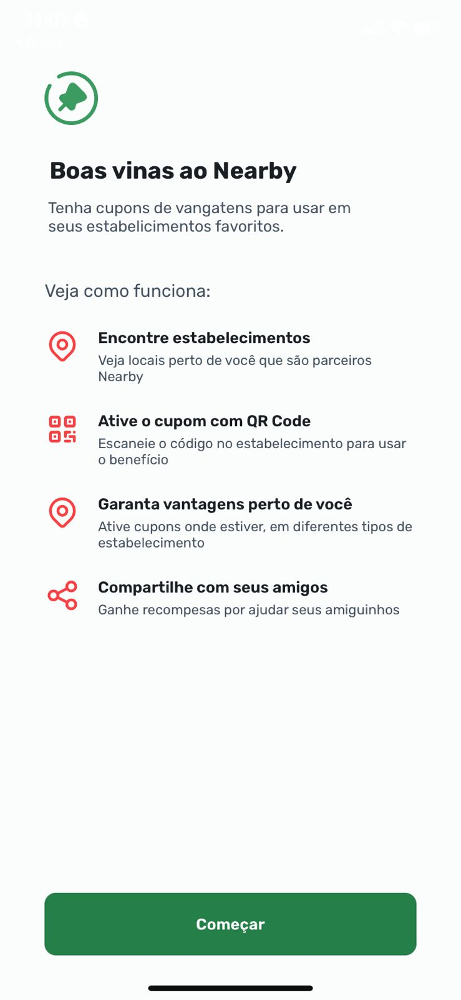
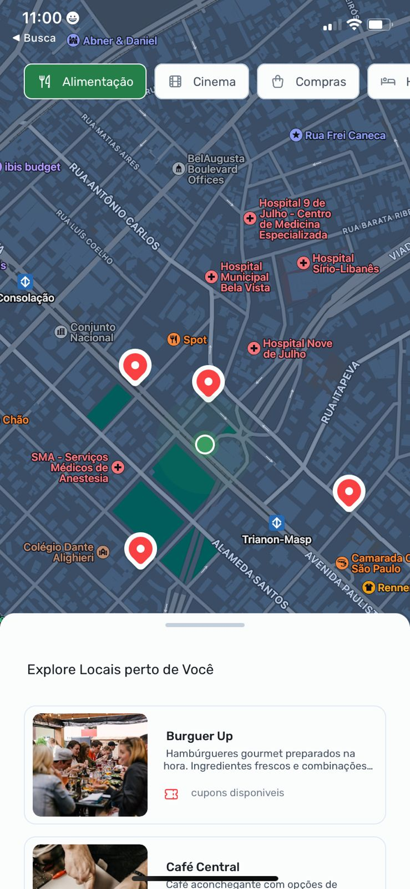
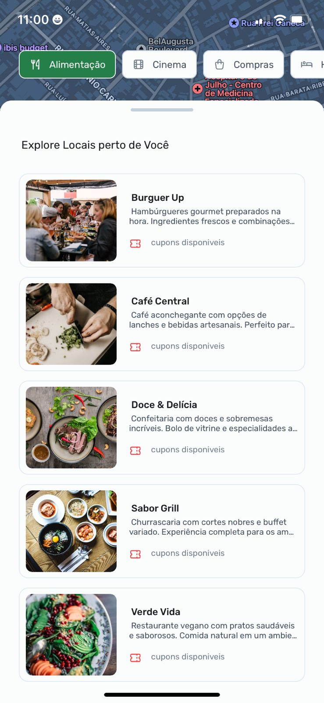
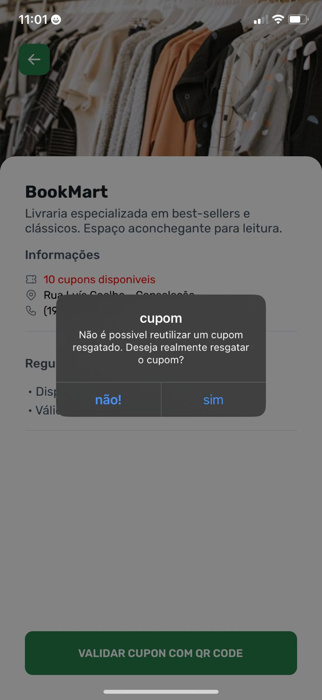

<h1 align="center">
  
</h1>

## 💻 Projeto

A aplicação **Nearby** É uma cuponeria onde você consegue verificar, pela sua localização, quais os estabelecimentos oferecem descontos escaneando o cupom com QR code.

## ✨ Tecnologias

Esse projeto foi desenvolvido com as seguintes tecnologias e ferramentas:

-   [ ] **React Native** - Biblioteca JavaScript para criar interfaces nativas.
-   [ ] **TypeScript** - Superset de JavaScript que adiciona tipagem estática.
-   [ ] **Expo** - Plataforma que facilita o desenvolvimento com React Native.
-   [ ] **Context API** - Gerenciamento de estado global simplificado.
-   [ ] **Async Storage** - Armazenamento persistente para salvar as tarefas localmente.
-   [ ] **Vector Icons** - Biblioteca para usar ícones vetoriais na aplicação.
-   [ ] **Styled Components** - Biblioteca para escrever estilos CSS em JavaScript.
-   [ ] **Node.js** - Runtime JavaScript para construção do backend, permitindo a execução do JavaScript no servidor.

## ✨ Bibliotecas

Esse projeto foi desenvolvido com as seguintes tecnologias e ferramentas:

-   [ ] **React Navigation** - Biblioteca para navegação e roteamento em aplicativos React Native.
-   [ ] **Axios** - Cliente HTTP baseado em Promises para realizar requisições a APIs.
-   [ ] **React Query** - Gerenciamento de estado remoto para sincronizar e gerenciar dados provenientes de APIs.
-   [ ] **React Native Maps** - Biblioteca para integração com mapas, permitindo a exibição de mapas e marcadores.
-   [ ] **Expo Location** - Biblioteca do Expo para acessar a localização do dispositivo.
-   [ ] **Expo Notifications** - Biblioteca do Expo para enviar e receber notificações push.
-   [ ] **Styled Components** - Biblioteca para estilização baseada em componentes.

## :hammer_and_wrench: Features

-   [ ] Botão para alterar cor de fundo.

## 🚀 Executando o Projeto

-Após clonar o repositório, siga os passos abaixo para rodar o projeto em seu ambiente local:

# Usando npm
-npm install

# usando yarn
-yarn install

# Agora so iniciar
-npx expo start

## 📸 Capturas de Tela

<table>
  <tr>
    <td align="center">
      
      
Boas Vindas

    </td>
    <td align="center">
      
      
Mapa

    </td>
    <td align="center">
      
      
Endereço dos Estabelecimento

    </td>
  </tr>
  <tr>
    <td align="center">
      
      
Lista de estabelecimentos

    </td>
    <td align="center">
      
      
Verificando Cupons

    </td>
    <td align="center">
      
      
Lendo QR Code

    </td>
    <td align="center">
      
      
Tela de Confirmação

    </td>
    <td align="center">
      
      
Recebendo Codigo

    </td>
    <td align="center">
      
      
Codigo Registrado

    </td>
  </tr>

</table>

